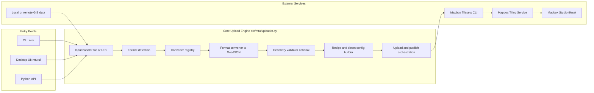
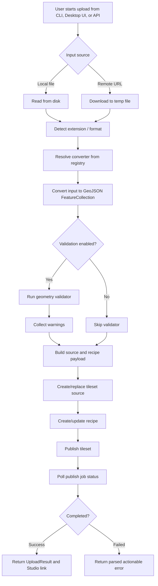

# Mapbox Tileset Uploader

Mapbox Tileset Uploader (`mtu`) is a Python package for preparing and publishing GIS data to Mapbox vector tilesets. It provides three interfaces: a CLI, a Python API, and a desktop UI. The project includes a modular converter pipeline that normalizes supported GIS formats to GeoJSON before validation, recipe creation, and tileset publishing.

[](https://pypi.org/project/mtu/)
[](https://pypi.org/project/mtu/)
[](https://pypi.org/project/mtu/)
[](https://opensource.org/licenses/MIT)

Releases: https://github.com/ocha-rosea/mapbox-tileset-uploader/releases

Notebook (shared workflow):
- Download: https://raw.githubusercontent.com/ocha-rosea/mapbox-tileset-uploader/main/notebooks/mtu_shared_workflow.ipynb
- View in repo: https://github.com/ocha-rosea/mapbox-tileset-uploader/blob/main/notebooks/mtu_shared_workflow.ipynb
- Open in Colab: https://colab.research.google.com/github/ocha-rosea/mapbox-tileset-uploader/blob/main/notebooks/mtu_shared_workflow.ipynb

GitHub Pages (zoom estimator):
- App URL: https://ocha-rosea.github.io/mapbox-tileset-uploader/
- Source: `docs/`

## Features


- **Upload**: GIS files to Mapbox Tiling Service (MTS)
- **Multi-format support**: GeoJSON, TopoJSON, Shapefile, GeoPackage, KML/KMZ, FlatGeobuf, GeoParquet, GPX
- **Geometry validation**: warns about invalid geometries without modifying data
- **Remote sources**: download and upload from URLs
- **Conversion pipeline**: automatic format detection and conversion to GeoJSON
- **Configurable output**: zoom levels, layer names, and recipes
- **Zoom estimator web app**: upload GeoJSON, compare min/max zoom ranges, and preview tile coverage on a map before running CLI/Notebook publishing
- **Upload guardrails**: default 1 GB upload cap across UI, CLI, and API (optional full-cap mode up to Mapbox's 20 GB per-file limit); backend always enforces Mapbox's hard 20 GB limit
- **Interfaces**: CLI, Python API, and desktop UI
- **Architecture**: modular converter system with optional dependencies

## Zoom Estimator (GitHub Pages)

The GitHub Pages app helps estimate how zoom ranges affect tile coverage before creating a Mapbox tileset.

Features:

- Upload local GeoJSON (`.geojson` or `.json`)
- Set `min zoom` and `max zoom` (`0-22`)
- Use presets aligned with project defaults:
  - CLI default: `0-10`
  - Notebook default: `4-8`
- Preview estimated tile coverage by zoom level
- Visualize source geometry, bounds, and tile grid overlay at a selected preview zoom

Notes:

- Estimates are based on Web Mercator tile coverage over the source bounding box.
- Actual tile density and Mapbox CU consumption can vary by geometry complexity and recipe settings.

## Installation

### Basic Installation (GeoJSON & TopoJSON only)

```bash
pip install mtu
```

### With Optional Format Support

```bash
# Shapefile support
pip install mtu[shapefile]

# GeoPackage, KML, FlatGeobuf support (via fiona)
pip install mtu[fiona]

# GeoParquet support
pip install mtu[geoparquet]

# GPX support
pip install mtu[gpx]

# Geometry validation (via shapely)
pip install mtu[validation]

# All formats and validation
pip install mtu[all-formats]

# All features including dev tools
pip install mtu[all]
```

### Install from Source

```bash
git clone https://github.com/ocha-rosea/mapbox-tileset-uploader.git
cd mapbox-tileset-uploader
pip install -e ".[all]"
```

## Supported Formats

| Format | Extensions | Dependencies | Notes |
| ------ | ---------- | ------------ | ----- |
| GeoJSON | `.geojson`, `.json` | None | Native support |
| TopoJSON | `.topojson` | None | Full decoder with transform support |
| Shapefile | `.shp`, `.zip` | `pyshp` | Supports zipped shapefiles |
| GeoPackage | `.gpkg` | `fiona` | Supports layer selection |
| KML/KMZ | `.kml`, `.kmz` | `fiona` | Handles zipped KMZ |
| FlatGeobuf | `.fgb` | `fiona` | Cloud-optimized format |
| GeoParquet | `.parquet`, `.geoparquet` | `geopandas`, `pyarrow` | Columnar format |
| GPX | `.gpx` | `gpxpy` | Tracks, routes, waypoints |

Check available formats with:

```bash
mtu formats
```

## Architecture



## Data Flow Diagram



## Prerequisites

1. **Mapbox Account**: Sign up at [mapbox.com](https://www.mapbox.com/)
2. **Access Token**: Use a non-URL-restricted token with the following scopes:
   - `tilesets:write`
   - `tilesets:read`
   - `tilesets:list`

  URL-restricted tokens can fail for CLI/desktop uploads because these flows do not send browser referrer URLs.

Set your credentials as environment variables:

```bash
export MAPBOX_ACCESS_TOKEN="your-token-here"
export MAPBOX_USERNAME="your-username"
```

### Capacity Units Warning (Free Accounts)

- Mapbox Capacity Units (CU) can be consumed quickly by large datasets, frequent republishes, and high zoom ranges.
- **Free accounts have limited CU quotas** and can hit limits or charges faster than expected.
- Start with small samples, use conservative zoom ranges, and avoid repeated full republishes.
- Check your Mapbox usage dashboard before large or repeated uploads.

## CLI Usage

The CLI command is `mtu`.

### Upload from URL

```bash
mtu upload \
  --url https://example.com/data.geojson \
  --id my-tileset \
  --name "My Tileset"
```

### Upload from Local File

```bash
mtu upload \
  --file data.geojson \
  --id my-tileset \
  --name "My Tileset"
```

By default, upload size is capped at 1 GB. To allow larger files (up to Mapbox's 20 GB limit):

```bash
mtu upload \
  --file large-data.geojson \
  --id my-tileset \
  --name "My Tileset" \
  --use-mapbox-full-upload-cap
```

### Desktop UI (Windows/macOS/Linux)

Launch the desktop uploader interface:

```bash
mtu ui
```

Or use the dedicated script:

```bash
mtu-ui
```

The desktop app provides:

- Intro/welcome page (first screen) with workflow, zoom defaults, and Mapbox cost/limit notes
- GIS file picker (including `.geojson` and zipped shapefile `.zip`)
- Mapbox credentials config panel (saved to `~/.mtu/desktop_config.json`)
- Tileset controls for final tileset name, zoom range, description, and attribution
- Mapbox capacity guard (user-configured MB capacity/usage) to block uploads when projected usage exceeds limit
- Optional description, attribution, validation toggle, and dry-run mode
- Auto-generated tileset ID (reported in the status log), warnings, and Mapbox Studio link on success

### Upload with Custom Options

```bash
mtu upload \
  --file data.topojson \
  --id boundaries-adm1 \
  --name "Administrative Boundaries Level 1" \
  --layer boundaries \
  --min-zoom 2 \
  --max-zoom 12 \
  --description "Admin level 1 boundaries" \
  --attribution "© OpenStreetMap contributors"
```

### Convert TopoJSON to GeoJSON

```bash
mtu convert input.topojson output.geojson --pretty
```

### Convert Any Supported Format

```bash
# Shapefile to GeoJSON
mtu convert boundaries.shp boundaries.geojson

# GeoPackage to GeoJSON
mtu convert data.gpkg output.geojson

# Zipped shapefile
mtu convert archive.zip output.geojson
```

### Validate GIS Files

Validate geometry without uploading:

```bash
mtu validate data.geojson
mtu validate boundaries.shp --verbose
```

### Show Available Formats

```bash
mtu formats
```

### Show Configuration Help

```bash
mtu info
```

### List Resources

```bash
# List all tileset sources
mtu list-sources

# List all tilesets
mtu list-tilesets
```

### Delete Resources

```bash
# Delete a tileset source
mtu delete-source my-source-id

# Delete a tileset
mtu delete-tileset my-tileset-id
```

### Dry Run Mode

Validate your file without uploading:

```bash
mtu upload --file data.geojson --id test --name "Test" --dry-run
```

## Python API Usage

```python
from mtu import TilesetUploader
from mtu.uploader import TilesetConfig

# Initialize uploader (uses environment variables by default)
uploader = TilesetUploader()

# Or provide credentials explicitly
uploader = TilesetUploader(
    access_token="your-token",
    username="your-username"
)

# Optional: allow larger files up to Mapbox's 20 GB per-file limit
uploader_full_cap = TilesetUploader(
  access_token="your-token",
  username="your-username",
  use_mapbox_full_upload_cap=True,
)

# Configure the tileset
config = TilesetConfig(
    tileset_id="my-tileset",
    tileset_name="My Tileset",
    layer_name="data",
    min_zoom=0,
    max_zoom=10,
    description="My geographic data"
)

# Upload from URL
results = uploader.upload_from_url(
    url="https://example.com/data.geojson",
    config=config
)

# Upload from local file
results = uploader.upload_from_file(
    file_path="data.geojson",
    config=config
)

if results.success:
    print(f"Tileset uploaded: {results.tileset_id}")
    if results.warnings:
        print(f"Warnings: {results.warnings}")
else:
    print(f"Error: {results.error}")
```

### Upload with Validation

```python
# Enable geometry validation (warns but doesn't modify data)
uploader = TilesetUploader(validate_geometry=True)

results = uploader.upload_from_file("data.geojson", config)

# Check validation results
if results.validation_result:
    for warning in results.validation_result.warnings:
        print(f"  [{warning.severity}] {warning.message}")
```

### Using Format Converters

```python
from mtu.converters import get_converter, get_supported_formats

# List available formats
formats = get_supported_formats()
for fmt in formats:
    status = "✓" if fmt["available"] else "✗ (missing deps)"
    print(f"{fmt['format_name']}: {status}")

# Convert any supported format
converter = get_converter(file_path="data.shp")  # Auto-detect by extension
result = converter.convert("data.shp")

print(f"Converted {result.feature_count} features from {result.source_format}")
print(f"Warnings: {result.warnings}")

# Or specify format explicitly
converter = get_converter(format_name="geopackage")
result = converter.convert("data.gpkg", layer_name="boundaries")
```

### Geometry Validation

```python
from mtu import validate_geojson, GeometryValidator

# Quick validation
result = validate_geojson(geojson_data)
print(f"Valid: {result.valid}, Features: {result.feature_count}")

# Custom validation options
validator = GeometryValidator(
    check_coordinates=True,   # Check coordinate bounds
    check_winding=True,       # Check polygon winding order  
    check_duplicates=True,    # Check duplicate vertices
    check_closure=True,       # Check ring closure
    check_intersections=True, # Check self-intersections (requires shapely)
    max_warnings=100          # Limit warnings
)

result = validator.validate(geojson_data)
for warning in result.warnings:
    print(f"Feature {warning.feature_index}: {warning.message}")
```

### TopoJSON Conversion

```python
from mtu.converters import get_converter

# Convert TopoJSON to GeoJSON
converter = get_converter(format_name="topojson")
result = converter.convert(topojson_data)
geojson = result.geojson

# From file
result = converter.convert("data.topojson")

# Select specific object in TopoJSON
result = converter.convert(topojson_data, object_name="countries")
```

## Custom Recipes

For advanced configurations, provide a custom MTS recipe:

```bash
mtu upload \
  --file data.geojson \
  --id my-tileset \
  --name "My Tileset" \
  --recipe custom-recipe.json
```

Recipe file example (`custom-recipe.json`):

```json
{
  "version": 1,
  "layers": {
    "boundaries": {
      "source": "mapbox://tileset-source/{username}/{source-id}",
      "minzoom": 0,
      "maxzoom": 14,
      "features": {
        "simplify": {
          "outward_only": true,
          "distance": 1
        }
      }
    }
  }
}
```

## Advanced

### Build Windows Executable (Self-Contained)

You can package the desktop UI as a self-contained Windows executable using PyInstaller.

Use a non-conda CPython interpreter (python.org build). Conda-based interpreters can produce
`_tkinter` DLL load failures in packaged apps.

### Environment Setup Options

#### Option A: Custom clean venv (recommended for packaging)

```powershell
winget install -e --id Python.Python.3.11
py -3.11 -m venv C:\Users\<you>\mtu-winbuild
C:\Users\<you>\mtu-winbuild\Scripts\python.exe -m pip install --upgrade pip
```

From the project root:

```powershell
./scripts/build_windows_exe.ps1 -PythonPath C:\Users\<you>\mtu-winbuild\Scripts\python.exe
```

#### Option B: ArcGIS Pro cloned environment (for ArcGIS stack compatibility)

Clone `arcgispro-py3` first, then install MTU into the clone:

```powershell
conda create --name arcgispro-mtu --clone arcgispro-py3
conda activate arcgispro-mtu
python -m pip install --upgrade pip
python -m pip install -e ".[all]"
```

Then build with the cloned environment interpreter:

```powershell
./scripts/build_windows_exe.ps1 -PythonPath C:\Users\<you>\anaconda3\envs\arcgispro-mtu\python.exe
```

If your clone lives under the ArcGIS Pro managed env location, use that `python.exe` path instead.

PyInstaller may generate `.spec` files during local packaging. These are optional build recipes;
the project build script above does not require committing them.

This creates a self-contained app in `dist/mtu-desktop/` (recommended, onedir mode).

To create a per-user installer (installs under `%LOCALAPPDATA%\\Programs` and does not require admin rights):

1. Install Inno Setup 6.
2. Build the desktop app folder with `scripts/build_windows_exe.ps1`.
3. Build the installer:

```powershell
./scripts/build_windows_installer.ps1 -AppVersion 1.2.3
```

Output:

```text
dist/ROSEA-MTU-v1.2.3-setup-user.exe
```

Optional signing for local build and CI:

- Set `WINDOWS_CERT_BASE64` to a Base64-encoded PFX.
- Set `WINDOWS_CERT_PASSWORD` to the PFX password.
- The build uses `scripts/sign_windows_artifacts.ps1` for executable signing and an Inno Setup `SignTool` hook for installer/uninstaller signing.
- If cert variables are missing or signing fails, current scripts are configured to continue without signature.

To create a portable ZIP (shareable folder build):

```powershell
Compress-Archive -Path .\dist\mtu-desktop\* -DestinationPath .\dist\mtu-desktop-portable.zip -Force
```

Run it by extracting the ZIP, then launching:

```powershell
./mtu-desktop.exe
```

If you build with an alternate output name (for example `mtu-desktop-si`), use the matching folder/exe name.

For a single-file executable:

```powershell
./scripts/build_windows_exe.ps1 -PythonPath C:\Users\<you>\mtu-winbuild\Scripts\python.exe -OneFile
```

Notes:

- The generated executable includes Python runtime and dependencies.
- If your system `tilesets.exe` launcher is broken, MTU automatically falls back to the in-process `mapbox-tilesets` module.
- For best reliability and startup speed, prefer onedir mode.
- UI startup window state (maximized/full-size on launch) is controlled in `src/mtu/ui.py` and applies to both source and packaged builds.

### Unsigned Distributables (Temporary)

Current distributed binaries are unsigned. Until code signing is enabled, you may see an OS trust warning.

Windows (SmartScreen):

1. In the "Windows protected your PC" dialog, click **More info**.
2. Confirm the app source/path, then click **Run anyway**.

Linux:

- There is no SmartScreen-style prompt, but your desktop/session may warn about unknown publishers.
- Make the app executable if needed: `chmod +x <binary>`.

Signing note:

- Windows Authenticode signing (PFX certificate) and Linux signing/notarization are separate systems.
- Do **not** expect the same Windows signing keys/certificate to satisfy Linux distribution signing requirements.
- Let's Encrypt certificates are TLS certificates and cannot be used for Windows Authenticode code signing.
- You cannot sign with certificates from other installed products unless you control/export their private key (which is typically non-exportable).

## License

MIT License - see [LICENSE](LICENSE) for details.

## Related Projects

- [mapbox-tilesets](https://github.com/mapbox/tilesets-cli) - Official Mapbox Tilesets CLI
- [geoBoundaries](https://www.geoboundaries.org/) - Open political boundary data
